# **Parte 1: Gestión de Usuarios**
1. Creación de Usuarios: Crea tres usuarios llamados `usuario1`, `usuario2` y `usuario3`.

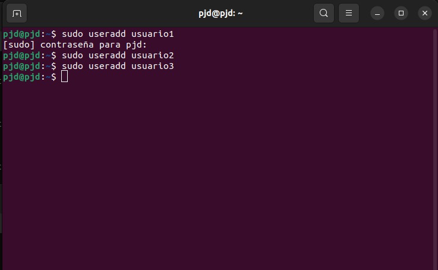

2. Asignación de Contraseñas: Establece una nueva contraseñas para cada usuario creado.

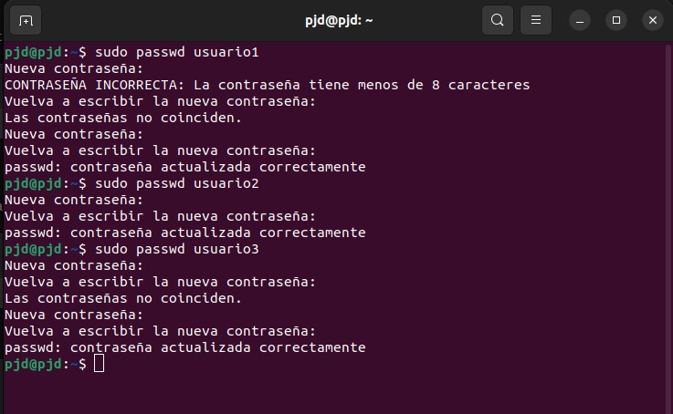

3. Información de Usuarios: Muestra la información de `usuario1` usando el comando `id`.

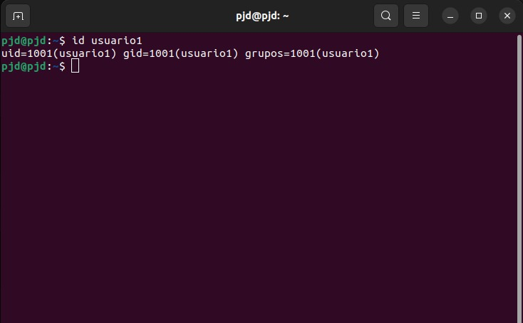

4. Eliminación de Usuarios: Elimina `usuario3`, pero conserva su directorio principal.

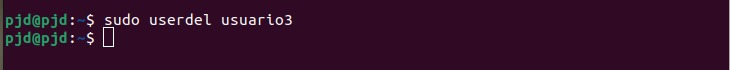

# **Parte 2: Gestión de Grupos**
1. Creación de Grupos: Crea dos grupos llamados `grupo1` y `grupo2`.

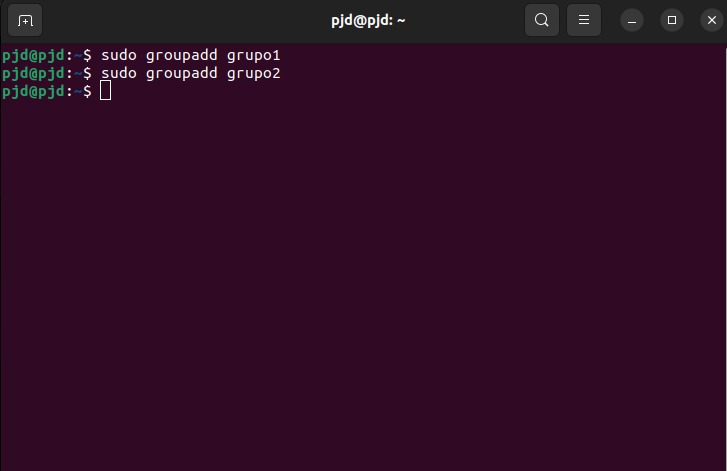

2. Agregar Usuarios a Grupos: Agrega `usuario1` a `grupo1` y `usuario2` a `grupo2`.

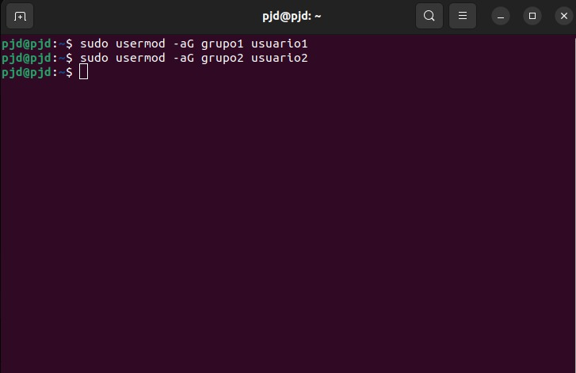

3. Verificar Membresía: Verifica que los usuarios han sido agregados a los grupos utilizando el comando `groups`.

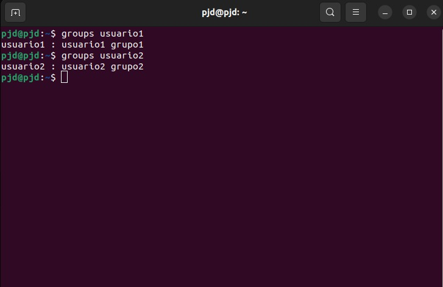

4. Eliminar Grupo: Elimina `grupo2`.

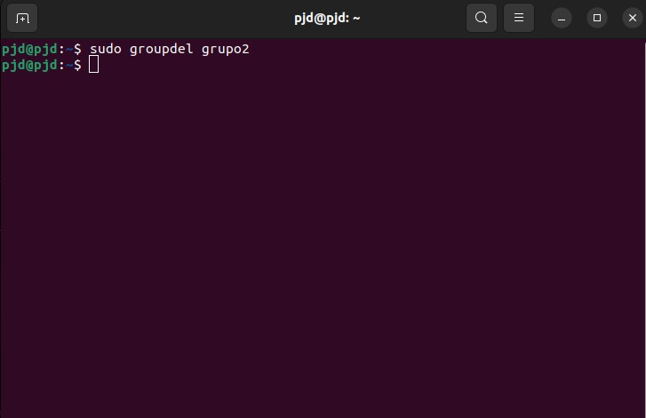

# **Parte 3: Gestión de Permisos**
1. Creación de Archivos y Directorios:
Como `usuario1`, crea un archivo llamado `archivo1.txt` en su directorio principal y escribe algo en él.
Crea un directorio llamado `directorio1` y dentro de ese directorio, un archivo llamado `archivo2.txt`.

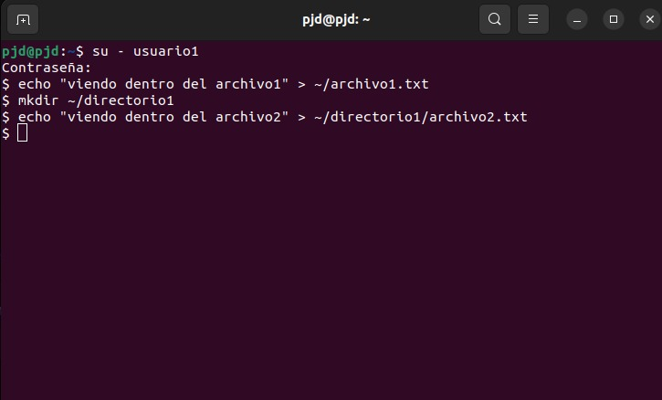

2. Verificar Permisos: Verifica los permisos del archivo y directorio usando el comando `ls -l` y `ls -ld` respectivamente.

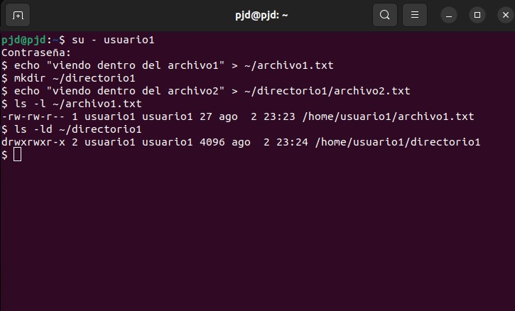

3. Modificar Permisos usando `chmod` con Modo Numérico: Cambia los permisos del `archivo1.txt` para que sólo `usuario1` pueda leer y escribir (permisos `rw-`), el grupo pueda leer (permisos `r--`) y nadie más pueda hacer nada.

> [!NOTE]
> Me equivoqué en el permiso y escribí el 644 (no interpreté correctamente), cuando en realidad debería haber sido 640.

4. Modificar Permisos usando `chmod` con Modo Simbólico: Agrega permiso de ejecución al propietario del `archivo2.txt`.

5. Cambiar el Grupo Propietario: Cambia el grupo propietario de `archivo2.txt` a `grupo1`.

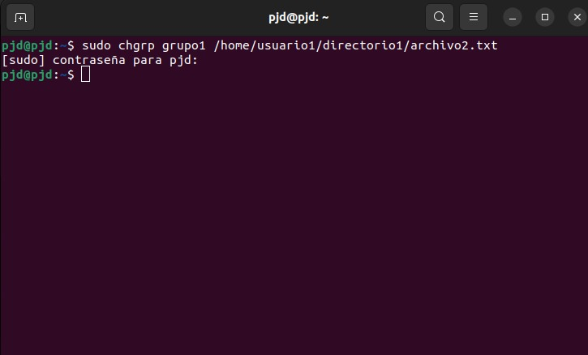

6. Configurar Permisos de Directorio: Cambia los permisos del `directorio1` para que sólo el propietario pueda entrar (permisos `rwx`), el grupo pueda listar contenidos pero no entrar (permisos `r--`), y otros no puedan hacer nada.

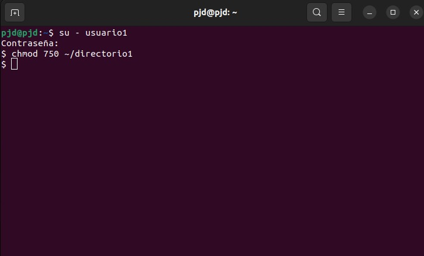

> [!NOTE]
> Me equivoqué en el permiso al teclear y escribí el 750, cuando en realidad debería haber sido 740. Esto cambia los resultados de los accesos del paso 7 y permisos del paso 8.

7. Comprobación de Acceso: Intenta acceder al `archivo1.txt` y `directorio1/archivo2.txt` como `usuario2`. Nota cómo el permiso de directorio afecta el acceso a los archivos dentro de él.

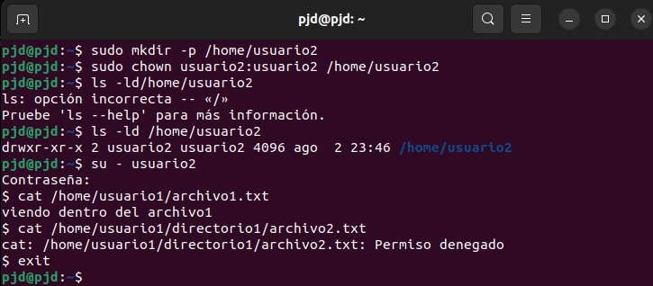

8. Verificación Final: Verifica los permisos y propietario de los archivos y directorio nuevamente con `ls -l` y `ls -ld`.

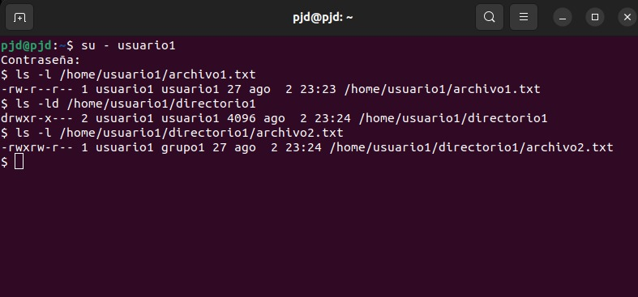

# **Reflexión: (Opcional)**
Contestar las siguientes preguntas:

¿Por qué es importante gestionar correctamente los usuarios y permisos en un sistema operativo?

> Es de gran importancia para mantener la seguridad y los datos de manera integra. Así mismo permite tener el control de quién puede acceder y modificar archivos, de tal manera que se previene de accesos no autorizados y así se evita la perdida de información o otros posibles daños.

¿Qué otros comandos o técnicas conocen para gestionar permisos en Linux?

> chown: para cambiar el propietario de un archivo, chmod: modifica permisos de manera granular, setfacl: establece listas de control de acceso que proporciona un control más detallado sobre permisos.